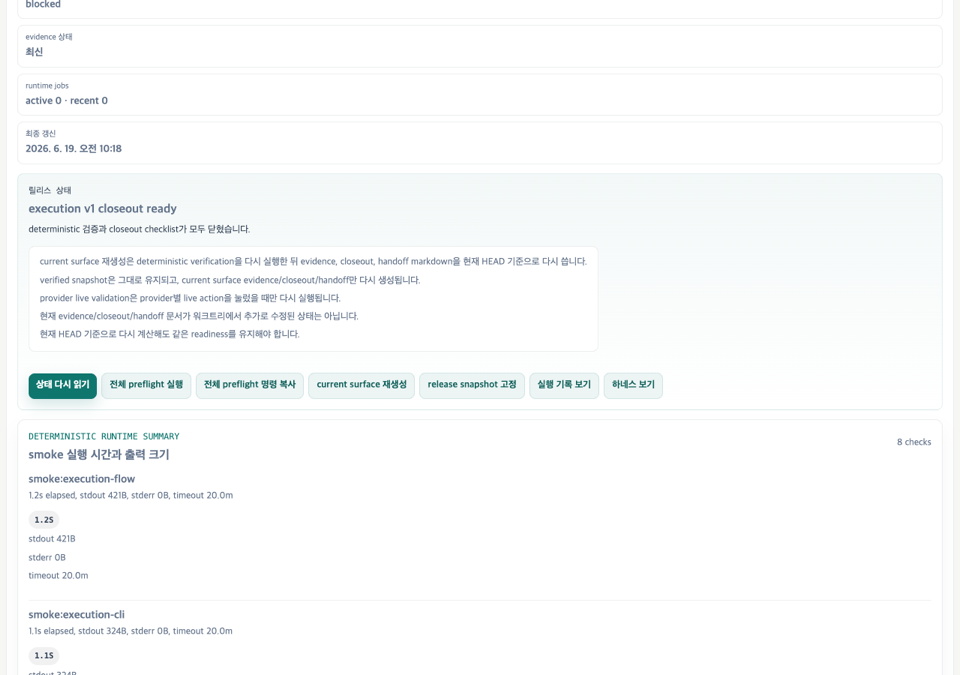

# Demo Evidence Index v1

- status: current-local-recorded-evidence
- publicHostedDemoUrl: none
- productionReadyClaim: false
- sourceSummary: [representative-release-demo-summary.json](../evidence/output-artifacts/representative-release-demo-summary.json)
- sourceReplayLog: [representative-release-demo-replay.log](../evidence/cli-logs/representative-release-demo-replay.log)
- sourceBrowserReport: [representative-release-demo-browser-e2e.json](../evidence/output-artifacts/representative-release-demo-browser-e2e.json)
- sourcePreview: [representative-release-demo-preview.png](../evidence/screenshots/representative-release-demo-preview.png)
- sourceScreenshot: [representative-release-demo-release-status.png](../evidence/screenshots/representative-release-demo-release-status.png)
- relatedWalkthrough: [demo-scenarios-v1.md](demo-scenarios-v1.md)
- relatedRecordedWalkthrough: [recorded-walkthrough-v1.md](recorded-walkthrough-v1.md)

## Purpose

This index gives reviewers one stable entry point for the current representative demo evidence. It is a recorded local replay, not a public hosted demo URL.

The evidence supports the scoped claim that this repository has a credential-free representative walkthrough for a provider-scoped local-first pilot boundary. It does not support a production-ready, all-provider-complete, or hosted SaaS claim.

The current repository includes a recording script, not a published walkthrough URL.

## Current Recorded Replay

| Field | Value |
|---|---|
| Demo | Representative Demo: Release Readiness Evidence Walkthrough |
| Captured at | 2026-06-23T08:40:08.751Z |
| Captured commit | `86101b552d8596907936203c95dc2ad3b346fc9c` |
| Credential-free | yes |
| Production-ready claim | false |
| Replay command count | 7 |
| Replay status | all recorded commands exited with status `0` |

## Evidence Files

| Evidence | Path | SHA-256 |
|---|---|---|
| Replay log | `evidence/cli-logs/representative-release-demo-replay.log` | `8964dc78afb928530406d0cccedfc95e685d3a45c33957e842ee679f464da074` |
| Replay summary | `evidence/output-artifacts/representative-release-demo-summary.json` | `c097314c66400cf5315162b9082a7a777a528d5d169571d81f7f97b77f04a7c4` |
| Browser E2E report | `evidence/output-artifacts/representative-release-demo-browser-e2e.json` | `eb279c7edb03033e6160775ea10e6205dba81ad4325657c39392f7fa65f62f34` |
| README preview screenshot | `evidence/screenshots/representative-release-demo-preview.png` | `a2d9c386c3a2ae40bbb35a2bb908bddcf66cca98d5c27010113916690c9b8fec` |
| Release status screenshot | `evidence/screenshots/representative-release-demo-release-status.png` | `0de6f7b2c8beb354b543b77d2bf28289ac8c025524ecf779f223787779a89bea` |



## Replay Commands

The recorded replay summary contains these credential-free commands:

```bash
npm run smoke:representative-demo
npm run smoke:execution-v1-status
npm run smoke:execution-v1-snapshot
npm run smoke:execution-v1-handoff
npm run smoke:release-artifact-hygiene
npm run smoke:portfolio-zip
npm run smoke:pilot-export-package
```

For the shortest local replay, use:

```bash
npm run demo:local
```

To refresh the recorded evidence files after intentional demo changes, run:

```bash
npm run evidence:representative-demo
npm run smoke:demo-evidence-index
npm run smoke:recorded-walkthrough
npm run smoke:representative-demo-evidence
```

## Claim Boundary

- There is no public hosted demo URL.
- The current evidence is a local recorded replay plus screenshot and browser report.
- The recorded walkthrough state is `recording-script-ready`; no video URL is verified yet.
- The demo remains credential-free and should not require OpenAI, Anthropic, local provider, or Hermes credentials.
- Production readiness remains explicitly blocked by release readiness evidence.
- Anthropic, Hermes, hosted SaaS, and target local provider production claims remain outside the current evidence boundary.
